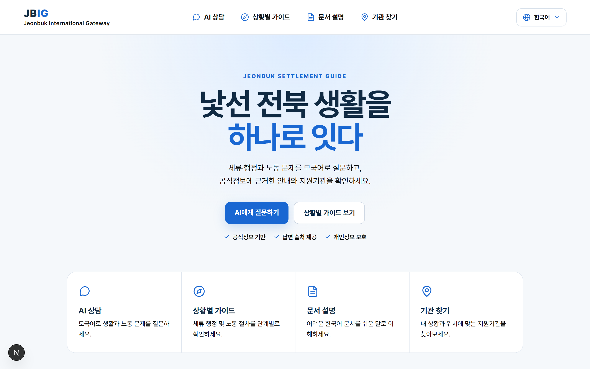
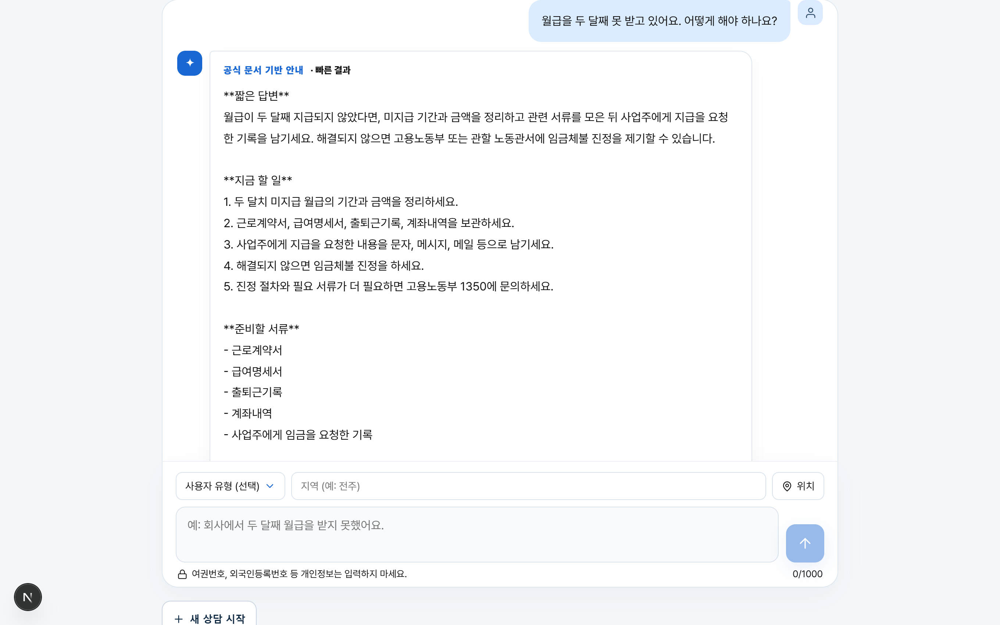
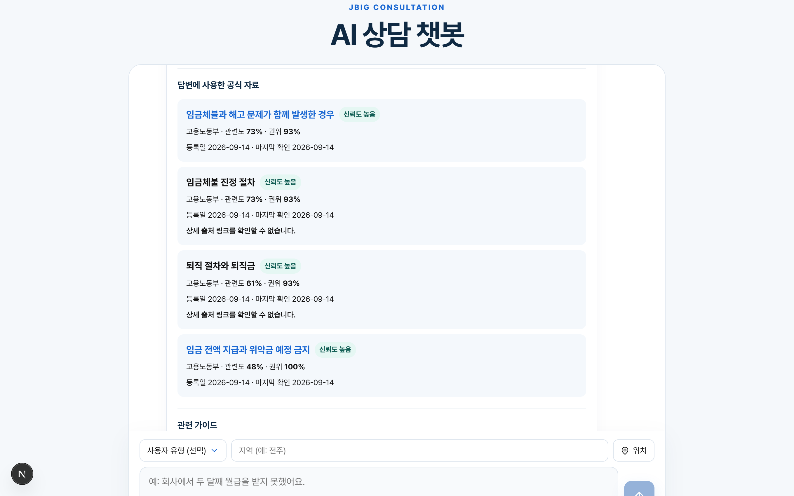
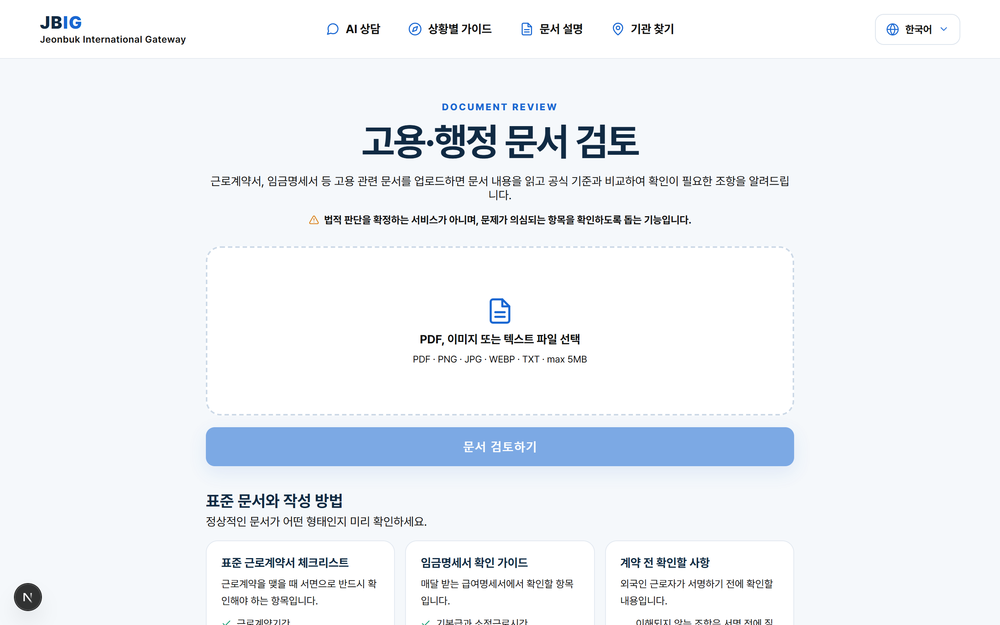
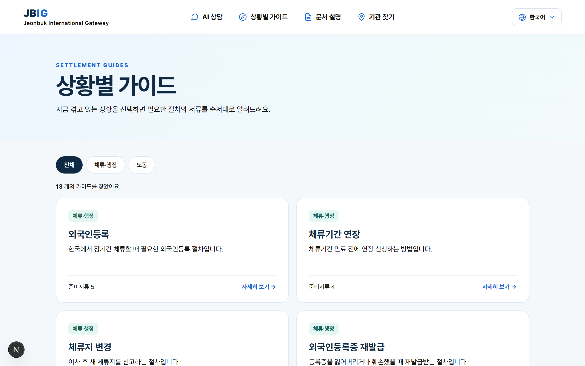
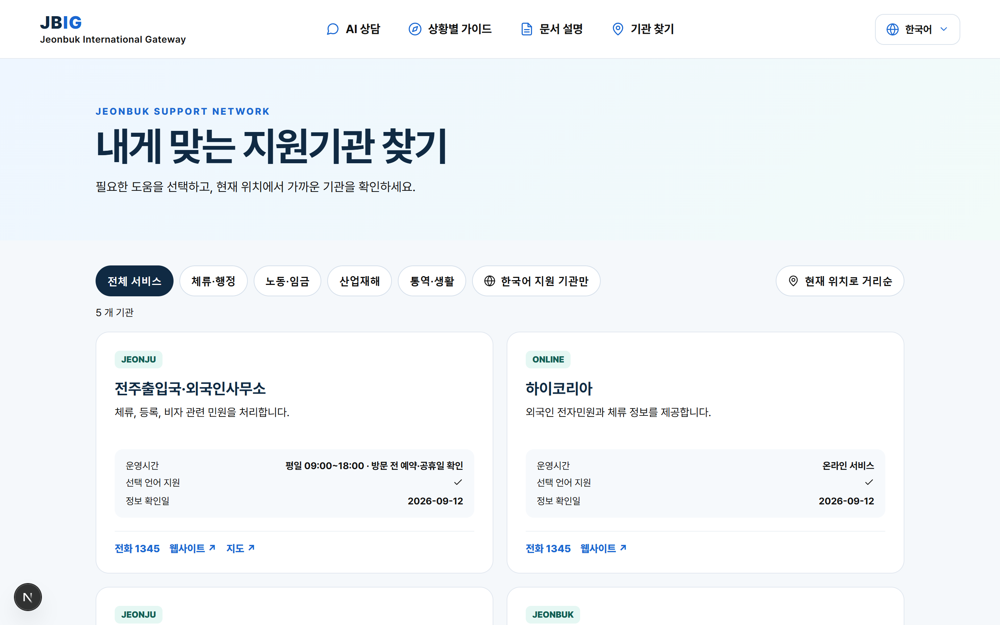

# JBIG — Jeonbuk International Gateway

전북에 거주하는 외국인 근로자와 유학생을 위한 **생성형 AI 정착지원 플랫폼**입니다.
체류·행정과 노동 문제를 모국어(한국어·영어·베트남어)로 질문하면, 검토된 공식 문서에 근거한 답변과 출처, 그리고 도움받을 수 있는 지원기관을 안내합니다.



## 왜 만들었나

낯선 언어와 제도 때문에 외국인 주민은 임금체불·계약 문제·체류 연장 같은 상황에서 정확한 정보를 찾기 어렵습니다. JBIG는 세 가지 원칙으로 이 문제를 풉니다.

- **공식정보 기반** — 상담마다 웹을 검색하지 않습니다. 관리자가 검토·승인한 공식 문서(법령·고용노동부·출입국 안내 등)만 RAG로 검색해 답변합니다. 근거가 부족하면 추측하지 않고 공식기관 확인을 안내합니다.
- **답변 출처 제공** — 모든 RAG 답변에 사용된 공식 자료의 문서명·발행기관·관련도·권위 점수·확인일을 함께 표시합니다. 출처 URL은 모델이 생성하지 않고 서버가 검색 메타데이터에서 구성합니다.
- **개인정보 보호** — 문서 OCR은 PaddleOCR로 전부 로컬에서 수행되어 원본 이미지가 외부로 나가지 않고, LLM 호출 전에 여권번호·전화번호 등 민감정보를 마스킹합니다.

## 주요 기능

### 1. 다국어 AI 상담

질문의 언어를 감지하고, 하이브리드 검색(키워드 + pgvector 벡터)으로 찾은 공식 문서 근거로 답변합니다. LLM 호출이 실패해도 규칙 기반 답변으로 폴백해 서비스가 끊기지 않습니다.



답변 하단에는 사용된 공식 자료가 신뢰도·관련도·권위 점수와 함께 표시됩니다.



### 2. 고용·행정 문서 검토

근로계약서, 임금명세서 등을 업로드하면 로컬 OCR로 텍스트를 추출하고, 위약금·최저임금 미달·가산수당 누락 같은 위험 조항을 규칙 기반으로 스크리닝한 뒤 공식 기준 문서와 비교해 설명합니다.



### 3. 상황별 가이드

외국인등록, 체류기간 연장, 임금체불 대응 등 13종의 절차 가이드를 3개 언어로 제공합니다. 필요한 서류와 단계, 흔한 실수까지 정리되어 있습니다.



### 4. 맞춤형 기관 연결

상황(체류·노동·산업재해·통역)과 현재 위치에 맞는 지원기관을 안내합니다. 좌표→지역 해석은 외부 API 없이 서버에서 결정적으로 처리합니다.



## 기술 구성

| 구분 | 내용 |
|------|------|
| 프론트엔드 | Next.js (App Router) + TypeScript — 다국어 UI(ko/en/vi) |
| 백엔드 | FastAPI — 상담 파이프라인(레이트리밋→캐시→규칙→RAG→LLM), 문서 분석, 기관/가이드 API |
| 검색(RAG) | 저장형 RAG: 검토·승인 문서만 색인. lexical(GIN) + 벡터(pgvector) 하이브리드 검색, 권위/최신성 랭킹 |
| 임베딩 | 로컬 sentence-transformers(384차원) 기본, OpenAI 임베딩 선택 가능 — 키 없이도 전 기능 동작 |
| OCR | PaddleOCR 로컬 엔진(이미지·스캔 PDF), 저신뢰 시 재촬영 안내 |
| 저장소 | PostgreSQL + pgvector — 미기동 시 인메모리 폴백으로 개발 가능 |
| 수집 | 공식 사이트 선별 크롤러 — 수집물은 `review_pending`으로만 등록, 사람이 승인해야 검색에 반영 |

```text
jbig/
├── frontend/   # Next.js 사용자 웹 (chat / documents / guides / agencies)
├── backend/    # FastAPI API — app/ 아래 기능별 패키지(core·chat·documents·retrieval·infra·crawler·scripts)
├── docs/       # 아키텍처·RAG 파이프라인·크롤러 문서
└── docker-compose.yml
```

> 📚 **더 읽기**: 아키텍처와 파이프라인 상세는 [docs/](./docs/README.md), 각 코드 폴더의 파일별 설명은 폴더 안의 README.md를 참고하세요.

---

## 실행 방법

### 요구사항

- Python 3.12+, Node.js 20+
- (선택) Docker — PostgreSQL/pgvector 실행용
- (선택) OpenAI API 키 — 없어도 로컬 임베딩·규칙 폴백으로 전 기능이 동작합니다

### 1. 백엔드

```bash
cd backend
python -m venv .venv
source .venv/bin/activate        # Windows: .venv\Scripts\activate
pip install -r requirements.txt
cp .env.example .env             # 필요 시 키·설정 수정
uvicorn app.main:app --reload --port 8000
```

API 문서: http://localhost:8000/docs

### 2. 프론트엔드

새 터미널에서 실행합니다.

```bash
cd frontend
npm install
cp .env.example .env.local       # NEXT_PUBLIC_API_URL을 백엔드 포트에 맞춤
npm run dev
```

웹: http://localhost:3000

### 3. PostgreSQL (선택)

```bash
docker compose up -d db
```

PostgreSQL이 없어도 가이드·샘플 RAG 문서의 인메모리 폴백으로 개발할 수 있습니다. 운영에서는 pgvector에 검토 문서와 임베딩을 저장하세요. 새 환경에서는 `python -m app.scripts.db_init`(또는 서버 시작 시 lifespan)이 idempotent 마이그레이션으로 스키마를 생성합니다.

### 4. RAG 색인·운영 (선택)

```bash
cd backend
python -m app.scripts.index_rag                    # 개발용 샘플 공식 문서 색인
python -m app.scripts.embed_guides                 # 가이드 임베딩
python -m app.scripts.crawl_official_docs --review # 공식 사이트에서 후보 수집(review_pending 등록)
python -m app.scripts.cli check-source-updates     # 등록 문서 원문 변경 감지(cron용)
python -m app.scripts.cli list-pending-updates     # 검토 대기 버전 조회
python -m app.scripts.cli approve-document-version <version-id> --reviewed-by admin --note "검토 완료"
```

수집·변경 감지된 문서는 승인 전까지 상담 검색에 들어가지 않습니다. 전체 워크플로는 [docs/rag-pipeline.md](./docs/rag-pipeline.md)와 [docs/crawler.md](./docs/crawler.md), 관리자 등록 API(`RAG_ADMIN_TOKEN`)와 환경변수 목록은 [backend/.env.example](./backend/.env.example)을 참고하세요.

### 5. 테스트

```bash
cd backend
python -m unittest discover -s tests   # 외부 API 0회, DB 없이 전부 통과
cd ../frontend
npx tsc --noEmit && npm run build
```
