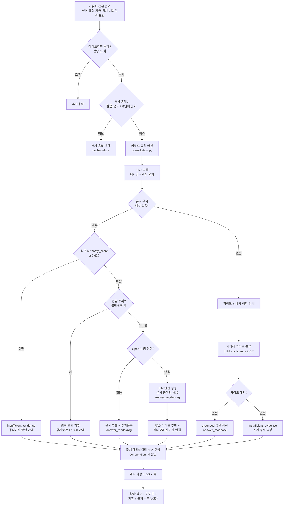
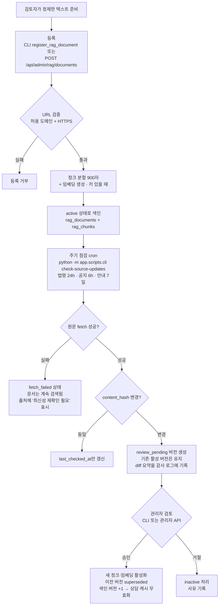
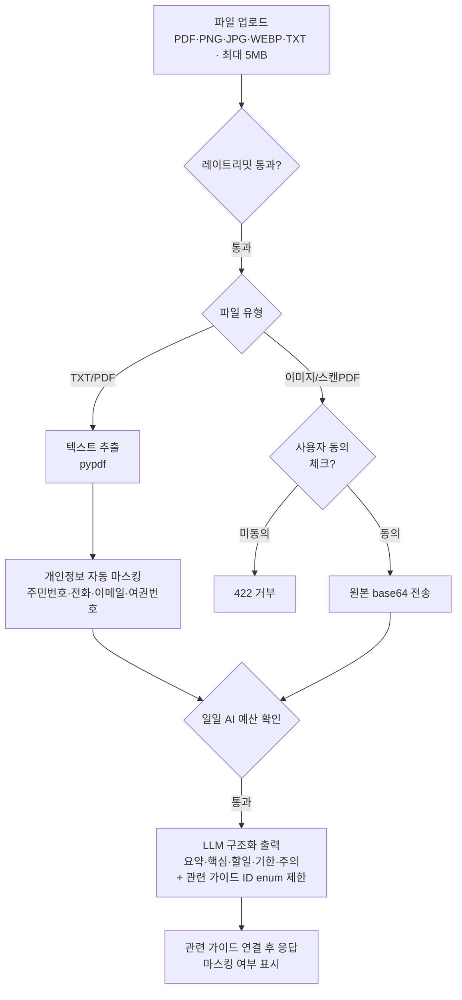

# JB Bridge AI — 프로세스 흐름 & 기능 문서 (PROCESS)

프로젝트의 주요 기능과 각 기능의 처리 흐름을 정리한 문서입니다. 전체 구조와 설계 원칙은 [DESIGN.md](./DESIGN.md)를 참고하세요.

## 1. 기능 요약

| 기능 | 화면 | API | 설명 |
|------|------|-----|------|
| AI 상담 | `/chat` | `POST /api/consultations` | 모국어로 체류·노동 문제를 질문하면 공식 자료 근거로 답변 |
| 상황별 가이드 | `/guides`, `/guides/[id]` | `GET /api/guides` | 상황별 절차·서류·주의사항을 단계별 안내 (10개 가이드) |
| 문서 설명 | `/documents` | `POST /api/documents/explain` | 행정·노동 문서(PDF/이미지/텍스트)를 쉬운 말로 요약 |
| 기관 찾기 | `/agencies` | `GET /api/agencies` | 서비스 유형·언어·현재 위치 기반으로 지원기관 연결 |
| 피드백 | 채팅 내 | `POST /api/feedback` | 답변 도움 여부 수집 |
| RAG 운영 | CLI / 관리자 API | `/api/admin/rag/*` | 공식 문서 등록·변경감지·승인 워크플로 |

## 2. AI 상담 프로세스 (핵심 흐름)



**폴백 원칙**: OpenAI 호출이 실패하거나 일일 예산(200회)을 초과하면 규칙 기반 결과나 문서 발췌를 그대로 반환합니다. 사용자는 오류 대신 항상 안전한 기본 안내를 받습니다.

### 답변 모드 구분

| answer_mode | 의미 | UI 표시 |
|-------------|------|---------|
| `rag` | 검토된 공식 문서 근거 답변 | "공식 문서 기반 안내" + 출처 카드 |
| `ai` | 가이드 데이터 근거 개인화 답변 | "AI 맞춤 안내" |
| `rules` | 키워드 매칭 기본 안내 | "기본 가이드 안내" |
| `guide_fallback` | 민감 주제 안전 응답 | 기본 안내 표시 |
| `insufficient_evidence` | 근거 부족, 추측 거부 | 경고 + 후속 질문 |

## 3. RAG 문서 수명주기 프로세스



**핵심 규칙**
- 상담 요청은 인터넷을 검색하지 않음 — 승인된 저장 문서만 사용
- 승인 전의 새 버전은 상담 검색에 절대 포함되지 않음
- 상담 캐시 키에 색인 버전이 포함되므로 승인 즉시 이전 답변 재사용이 중단됨

## 4. 문서 설명 프로세스



## 5. 기관 찾기 프로세스

```text
필터 선택 (서비스 유형 / 내 언어 지원만)
  → GET /api/agencies?service_type=&language=&latitude=&longitude=
  → 위치 제공 시: Haversine 공식으로 거리 계산 → distance_km 오름차순 정렬
  → 카드 표시: 운영시간, 지원 언어, 전화/웹사이트/지도 링크, 24시간 기관 뱃지
```

등록 기관 (5곳): 전주출입국·외국인사무소(1345), 하이코리아(온라인), 고용노동부 전주지청(1350), 근로복지공단(1588-0075), 다누리콜센터(1577-1366, 15개 언어, 24시간).

## 6. 다국어(i18n) 처리 흐름

```text
URL ?lang= 파라미터 (없으면 ko)
  → localStorage 저장값 자동 복원 (LanguageSwitcher)
  → 프론트: i18n.ts 메시지 사전에서 UI 문구 선택
  → 백엔드: 요청 language 필드 또는 문자 패턴 자동 감지 (한글/베트남어 성조 문자)
  → 데이터: 가이드·기관은 {ko, en, vi} 다국어 필드 저장, 없으면 ko 폴백
```

## 7. 운영·보호 장치 흐름

| 장치 | 동작 |
|------|------|
| 레이트리밋 | 클라이언트 IP 해시 기준 분당 10회, 초과 시 429 |
| 상담 캐시 | 동일 질문 10분 캐시 (최대 500건, LRU 유사 제거) |
| AI 예산 | 일일 200회 (DB 카운터 우선, 실패 시 메모리) — 초과 시 규칙 기반 폴백 |
| DB 장애 | 연결 실패 시 30초간 재시도 차단 후 메모리 데이터로 서비스 지속 |
| 지표 수집 | 상담 수·캐시 히트·AI 호출·폴백·피드백 → `GET /api/operations/status` |

## 8. 개발·검증 프로세스

```bash
# 백엔드 실행
cd backend && python3 -m venv .venv && source .venv/bin/activate
pip install -r requirements.txt
uvicorn app.main:app --reload --port 8000       # http://localhost:8000/docs

# 프론트엔드 실행
cd frontend && npm install && cp .env.example .env.local
npm run dev                                      # http://localhost:3000

# DB (선택)
docker compose up -d db                          # pgvector:pg16
python -m app.scripts.db_init                            # 스키마 생성 + 시드
python -m app.scripts.index_rag                          # 샘플 RAG 문서 색인
python -m app.scripts.embed_guides                       # 가이드 임베딩 (OpenAI 키 필요)

# 테스트
cd backend && python -m unittest discover -s tests -v   # 66개 테스트
cd frontend && ./node_modules/.bin/tsc --noEmit && npm run build

# RAG 운영 (cron 권장)
python -m app.scripts.cli check-source-updates
python -m app.scripts.cli list-pending-updates
python -m app.scripts.cli approve-document-version <version-id> --reviewed-by admin --note "검토 완료"
python -m app.scripts.cli reject-document-version <version-id> --reviewed-by admin --note "사유"
```
