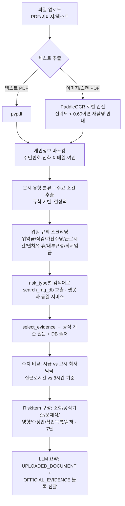

# OCR 문서 분석의 RAG 활용 구조

`POST /api/documents/explain`이 업로드된 고용 문서(근로계약서 등)를 읽고, **PostgreSQL에 저장된 승인 공식 문서**와 비교해 위험 조항을 설명하는 구조입니다.

## 전체 흐름



## 1. OCR 단계 (`app/documents/ocr.py`)

- PaddleOCR(PP-OCRv5 korean 모델, 로컬 실행 — 이미지가 서버 밖으로 나가지 않음)
- 전처리: EXIF 회전 → grayscale/autocontrast → 크기 정규화
- 스캔 PDF: pypdf 텍스트가 40자 미만이면 PyMuPDF로 페이지 렌더링(최대 `OCR_MAX_PAGES=5`) 후 OCR
- 글자수 가중 평균 confidence < `OCR_MIN_CONFIDENCE`(0.60) → **분석하지 않고** 재촬영 안내 반환
- 엔진 미설치/디코딩 불가 → 기존 동의+LLM 경로 폴백

## 2. 위험 규칙 → risk_type별 RAG 질의

문서 전체를 검색어로 넣지 않습니다. 규칙이 감지한 위험 후보마다 **고정 검색어**로 챗봇과 동일한 `search_rag_db(query, category="labor")`를 호출합니다 (문서당 최대 `RAG_DOCUMENT_MAX_QUERIES=8`회, `select_evidence`로 상위 2건).

| risk_type | 검색어 | 매칭되는 공식 기준 문서 |
|-----------|--------|------------------------|
| 위약금·손해배상 예정 | "위약금 손해배상액 근로계약" | 임금 전액 지급과 위약금 예정 금지 |
| 임금 일방 삭감 | "임금 전액 지급 일방적" | 〃 |
| 가산수당 미지급 | "가산수당 야간근로 통상임금" | 연장·야간·휴일근로 가산수당 기준 |
| 근로시간 초과 | "근로시간 휴게시간 기준" | 법정 근로시간과 휴게시간 기준 |
| 연차 미부여 | "연차 유급휴가 발생 기준" | 연차 유급휴가 발생 기준 |
| 무급 주휴 | "유급 주휴일 기준" | 유급 주휴일 기준 |
| 내부규정 우선 | "취업규칙 내부규정 법령" | 취업규칙과 법령의 관계 |
| 최저임금 | "최저임금 시간급 고시" | 2026년 적용 최저임금 고시 |

## 3. 근거 기반 판정 원칙

- **WARNING은 DB 근거가 검색된 경우에만.** 근거가 없으면 CHECK로 강등 + 조건부 표현("적용 조건 확인이 필요합니다")
- **DB 장애 시**: OCR·요약·후보 감지는 계속되지만 기준 비교는 CHECK + "공식 자료 검색에 일시적으로 접근할 수 없어…" — SAMPLE 문서를 DB 근거인 것처럼 몰래 쓰지 않음 (`RAG_USE_SAMPLE_DOCUMENTS_FOR_TESTS`는 테스트/개발 전용, 기본 false)
- **수치는 RAG 문서에서 파싱**: 최저임금 금액·연도는 고시 문서 텍스트에서 정규식으로 추출해 계약서 시급과 실계산("9,500원은 10,320원보다 820원 낮습니다"). 고시를 못 찾으면 임의 계산 없이 CHECK
- 공식 기준 원문(`official_standard`)은 ko는 청크 인용, en/vi는 동일 문서의 번역 설명 — 출처 메타데이터는 항상 DB 원본 유지

## 4. LLM 입력 구조

```
[UPLOADED_DOCUMENT]
(마스킹된 업로드 문서 텍스트)

[OFFICIAL_EVIDENCE]
--- Title / Publisher / Relevant excerpt / Checked at --- (항목당 상위 출처 1건, 최대 8문서)
```

프롬프트 규칙: 문서 설명은 UPLOADED_DOCUMENT만, 기준 비교는 OFFICIAL_EVIDENCE만, 자체 지식으로 기준 보충 금지, 출처 제목·URL 생성 금지(모델이 생성한 URL은 서버가 제거), "불법 확정" 표현 금지. 근거 부족 시 "등록된 공식 자료에서 충분한 근거를 찾지 못했습니다"로 답하게 함.

## 5. 응답 (RiskItem)

```json
{
  "level": "WARNING|CHECK|SAFE",
  "title": "임금 일방 삭감 조항",
  "clause": "계약서 원문 (항상 원문 유지)",
  "official_standard": "RAG 문서에서 인용한 공식 기준",
  "problem": "...", "impact": "...", "recommended_revision": "...",
  "checks": ["..."],
  "detected_value": "9500", "official_value": "10320", "difference": "-820",
  "sources": [{ "document_id", "title", "publisher", "url", "verified_at",
                "last_checked_at", "trust_level", "authority_score", ... }]
}
```

설명 필드는 UI 언어(ko/en/vi)를 따르고(`RISK_TEXTS` 사전), `clause`와 출처 메타데이터는 원본을 유지합니다.
